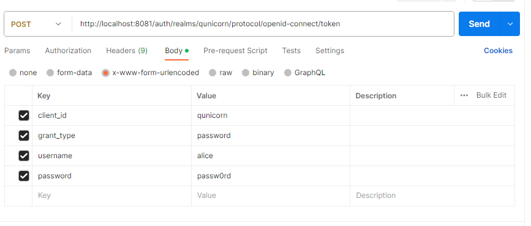

Authentication
=========================================
Authentication is based on OAuth2. The docker-compose contains a KeyCloak Service for handling the user management.
The Realm already contains the client configuration for qunicorn.
After start up of the KeyCloak Service one can add users via the management interface.
The management interface is exposed on port `8081`. The following credentials are required to login: username: `kc_user`, password: `kc_pass`.
After login the realm has to switched to qunicorn in the top left dropdown menu.

Start KeyCloak
--------------
The KeyCloak Docker Compose: `keycloak-docker-compose.yml` can be started by executing the following command:

[PathToDocker]\docker-compose.exe -f [PathToDockerCompose]\keycloak-docker-compose.yaml -p qunicorn-core up -d

After it has been started it should be possible to access KeyCloak `http://localhost:8081`

Alternatively the KeyCloak Service can be started by using the general `docker-compose.yaml`.
After the changes to qunicorn from the `Start Qunicorn`-Section the docker needs to be restarted.
Then afterwards qunicorn must not be started locally later, but can also not be debugged.

Create a User
-------------
After the KeyCloak Service has been started it is possible to create a user.
First navigate to the Administration Console use username and password mentioned before.
After login the realm has to switched to qunicorn in the top left dropdown menu.
Then navigate to Users and click on Add User. Add a user with a name and safe it.
Now click on view all users and click on the id of the created user.
Navigate to Credentials and add also a password for the user.

Get an Authentication Token
---------------------------

Authentication token can retrieved by using the `Resource Owner Password Credentials Grant Flow <https://datatracker.ietf.org/doc/html/rfc6749#section-4.3>`_
The following shows an example how to accomplish this by using curl

.. code-block:: bash

    curl --location 'http://localhost:8081/auth/realms/qunicorn/protocol/openid-connect/token' \
    --header 'Content-Type: application/x-www-form-urlencoded' \
    --data-urlencode 'client_id=qunicorn' \
    --data-urlencode 'grant_type=password' \
    --data-urlencode 'username=alice' \
    --data-urlencode 'password=passw0rd'

If this does not work it is also possible to use postman for this:

After sending the request a response with an access_token should be returned.
This access Token needs to be saved. It will be used for the authentication of the requests to the qunicorn core.

Start Qunicorn
--------------

Before starting qunicorn the following environment variables have to be set:
`JWKS_URL="http://localhost:8081/auth/realms/qunicorn/protocol/openid-connect/certs"`
This can be done by adding the JWKS_URL to the `.env` file.
After that qunicorn can be started locally.
After opening the Qunicorn-API: `http://localhost:5005/swagger-ui/` click on the Authorize in the top right corner and enter your access token.
Now you can test if this works, by creating a deployment and get all deployments. (Then all should be visible)
Logging out again by clicking again on the authorize button.
Now you can again retrieve all deployments and your new deployment should not be visible.
