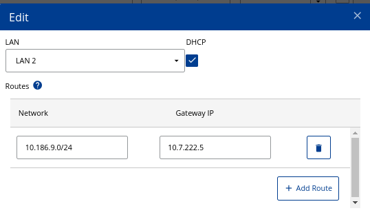
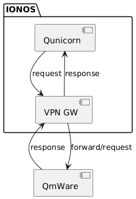

# Setup Qunicorn in IONOS Dedicated Kubernetes Cluster

Qunicorn components were deployed in the dedicated Kubenetes cluster [Qunicorn Testcenter](https://dcmanager.any.profitbricks.net/vnetwork/81e69aa1-1672-4cf0-87a8-9e40d4bb98ea/#tab-vserver). The cluster is manageable in [DCD](https://dcd.ionos.com/latest/).
To get access to the cluster download `kubeconfig.conf` available in [DCD](https://dcd.ionos.com/latest/) in the section _Containers -> Managed Kubernetes -> uqunicorn-test-cluster -> Cluster Settings_.

## Install Metric Server (optional)

[Kubernetes Metrics Server](https://github.com/kubernetes-sigs/metrics-server)

```
kubectl apply -f https://github.com/kubernetes-sigs/metrics-server/releases/latest/download/components.yaml
# resolve: failed to verify certificate: x509
kubectl patch -n kube-system deployment metrics-server --type=json \
  -p '[{"op":"add","path":"/spec/template/spec/containers/0/args/-","value":"--kubelet-insecure-tls"}]'
```

## Setup Broker/Redis

Enforce [AUTH](https://redis.io/docs/latest/commands/auth/) by setting `--requirepass` parameter in the [minikube/brocker-deployment.yaml](../../minikube/broker-deployment.yaml)
* create a secret
```
$ _BROKER_PASSWD=<???>
$ kubectl create secret generic broker-secret --from-literal password=$_BROKER_PASSWD
```
* create service
```
kubectl apply -f minikube/broker-service.yaml
```
* remove `hostPort` from `minikube/broker-deployment.yaml`
```
$ git diff minikube/broker-deployment.yaml
diff --git a/minikube/broker-deployment.yaml b/minikube/broker-deployment.yaml
index c1f41cc..0553896 100644
--- a/minikube/broker-deployment.yaml
+++ b/minikube/broker-deployment.yaml
@@ -28,6 +28,5 @@ spec:
           command: ["redis-server", "--requirepass", "$(BROKER_PASSWORD)"]
           ports:
             - containerPort: 6379
-              hostPort: 6379
               protocol: TCP
       restartPolicy: Always
```
* create deployment
```
$ kubectl apply -f minikube/broker-deployment.yaml
```

## Setup Database

```
kubectl apply --filename minikube/postgres-persistent-volume.yaml
kubectl apply -f minikube/postgres-service.yaml
kubectl apply -f minikube/postgres-deployment.yaml
```

### Populate Database

This step should be executed for initial setup only if `\dt` shows `Did not find any relations.`
```
kubectl exec -it postgres-0 -- bash
root@postgres-0:/# psql --user postgres --password
Password: 
psql (15.3 (Debian 15.3-1.pgdg120+1))
Type "help" for help.

postgres=> \c qunicorn
Password: 
You are now connected to database "qunicorn" as user "postgres".
qunicorn=> \dt
Did not find any relations.
```

* run `update-db` task in a qunicorn POD
```
kubectl exec -it server-6f5b49b58c-857tg -- python -m invoke upgrade-db
```
* check the result in the postress POD
```
qunicorn=> \dt
                   List of relations
 Schema |           Name            | Type  |  Owner
--------+---------------------------+-------+----------
 public | Deployment                | table | postgres
 public | Device                    | table | postgres
 public | Job                       | table | postgres
 public | Provider                  | table | postgres
 public | ProviderAssemblerLanguage | table | postgres
 public | QuantumProgram            | table | postgres
 public | Result                    | table | postgres
 public | TransientJobState         | table | postgres
 public | alembic_version           | table | postgres
(9 rows)
```

## Deploy Qunicorn Components

* create QMWare secret
```
kubectl create secret generic qmware-secret --from-literal="QMWARE_API_KEY=<???>" --from-literal="QMWARE_API_KEY_ID=<???>"
secret/qmware-secret created
```
* prepare qunicorn components
  * add `QMWARE_URL` to `minikube/worker-deployment.yaml` and `minikube/server-deployment.yaml`
  * remove `hostPort` from `minikube/server-deployment.yaml`
```
$ git diff minikube/server*
diff --git a/minikube/server-deployment.yaml b/minikube/server-deployment.yaml
index 7135ccb..f1c5401 100644
--- a/minikube/server-deployment.yaml
+++ b/minikube/server-deployment.yaml
@@ -49,14 +49,12 @@ spec:
                 secretKeyRef:
                   name: qmware-secret
                   key: QMWARE_API_KEY_ID
-            # the URL of the QMware API is to be set here
-            # - name: QMWARE_URL
-            #   value: ???
+            - name: QMWARE_URL
+              value: http://10.186.9.12:9003/
           image: ghcr.io/qunicorn/qunicorn-core:main
           name: server
           ports:
             - containerPort: 8081
-              hostPort: 8081
               protocol: TCP
           securityContext:
             allowPrivilegeEscalation: false
```
* apply deployments
```
kubectl apply -f minikube/worker-deployment.yaml
kubectl apply -f minikube/server-deployment.yaml
```

## Setup a proxy as a LoadBalancer service

The proxy just takes care about basic auth and redirects on success all the requests to the qunicorn-core-app container

```
_QUSER=<????>
_QPASSWD=<???>
```
* create basic-auth-qunicorn secret for nginx `.htpasswd`
```
kubectl create secret generic basic-auth-qunicorn --from-literal=".htpasswd=$_QUSER:$(echo $_QPASSWD | openssl passwd -apr1 -stdin | tr --delete '\n')" 
```
* create basic-auth-credentials for end user pupose
```
kubectl create secret generic basic-auth-credentials --from-literal="user=$_QUSER" --from-literal="password=$_QPASSWD"
```
* ensure `proxy_pass` value in [nginx-proxy.yaml](../../minikube/nginx-proxy.yaml) matchs server IP
```
$ kubectl get service server 
NAME     TYPE        CLUSTER-IP     EXTERNAL-IP   PORT(S)    AGE
server   ClusterIP   10.233.62.14   <none>        8081/TCP   22h
```
* create nginx-proxy deployment
```
kubectl apply --filename minikube/nginx-proxy.yaml
```
* expose nginx-proxy deployment
```
kubectl expose deployment nginx-proxy --type LoadBalancer --name nginx-service --target-port 8080 --port 8080
```
* wait a while until the service gets `status.loadBalancer.ingress[0].ip`
```
kubectl get service/nginx-service --output jsonpath='{@.status.loadBalancer.ingress[0].ip}'
```
* connect to the service
```
_QIP=$(kubectl get service/nginx-service --output jsonpath='{@.status.loadBalancer.ingress[0].ip}')
_QUSER=$(kubectl get secret basic-auth-credentials --output jsonpath='{.data.user}'|base64 -d)
_QPASSWD=$(kubectl get secret basic-auth-credentials --output jsonpath='{.data.password}'|base64 -d)
curl -H "Authorization: Basic $(echo -n $_QUSER:$_QPASSWD | base64)" http://$_QIP:8080/
```
## VPN-GW

[Volker Jost](https://united-internet.org/profiles/people/21200409) setup [VPN-GW](https://dcmanager.any.profitbricks.net/vserver/3c8b0853-e07b-4b8f-8a11-073d606c450a/) VM in the [Qunicorn Testcenter](https://dcmanager.any.profitbricks.net/vnetwork/81e69aa1-1672-4cf0-87a8-9e40d4bb98ea/#tab-vserver).
Initiall setup based on [k8s-staticroute-operator](https://github.com/digitalocean/k8s-staticroute-operator) has been replaced by an additional route added to _Attached private LANs'_ in the section _Containers -> Kubernetes Manager_ in [DCD](https://dcd.ionos.com/latest/#/registries/8c8403b2-c9fd-43d5-96e0-0ab086b70b40/repositories).




## VPN-GW Maintenance

* `ssh` to the public ip of [VPN-GW](https://dcmanager.any.profitbricks.net/vserver/3c8b0853-e07b-4b8f-8a11-073d606c450a/)
```
$ ssh alexei@85.215.239.223
```
* check status
```
alexei@VPN-GW:~$ sudo ipsec statusall
Status of IKE charon daemon (strongSwan 5.9.5, Linux 5.15.0-107-generic, x86_64):
  uptime: 12 days, since Jul 05 09:34:02 2024
  malloc: sbrk 3649536, mmap 0, used 2213248, free 1436288
  worker threads: 10 of 16 idle, 5/0/1/0 working, job queue: 0/0/0/0, scheduled: 2
  loaded plugins: charon test-vectors ldap pkcs11 tpm aesni aes rc2 sha2 sha1 md5 mgf1 rdrand random nonce x509 revocation constraints pubkey pkcs1 pkcs7 pkcs8 pkcs12 pgp dnskey sshkey pem openssl gcrypt af-alg fips-prf gmp curve25519 agent chapoly xcbc cmac hmac ctr ccm gcm ntru drbg curl attr kernel-netlink resolve socket-default connmark forecast farp stroke vici updown eap-identity eap-aka eap-md5 eap-gtc eap-mschapv2 eap-dynamic eap-radius eap-tls eap-ttls eap-peap eap-tnc xauth-generic xauth-eap xauth-pam tnc-tnccs dhcp lookip error-notify certexpire led addrblock unity counters
Listening IP addresses:
  85.215.239.223
  10.7.222.5
Connections:
      qmware:  85.215.239.223...85.215.0.134  IKEv2
      qmware:   local:  [Qunicorn-VPNGW] uses pre-shared key authentication
      qmware:   remote: [85.215.0.134] uses pre-shared key authentication
     net-net:   child:  0.0.0.0/0 === 10.186.9.0/24 TUNNEL
Security Associations (1 up, 0 connecting):
      qmware[59]: ESTABLISHED 2 hours ago, 85.215.239.223[Qunicorn-VPNGW]...85.215.0.134[85.215.0.134]
      qmware[59]: IKEv2 SPIs: 8430d6039472f85c_i* 7bfcc1b419b7aabf_r, rekeying in 66 minutes
      qmware[59]: IKE proposal: AES_CBC_256/HMAC_SHA2_512_256/PRF_HMAC_SHA2_512/ECP_521
     net-net{241}:  INSTALLED, TUNNEL, reqid 1, ESP SPIs: c8c0cb69_i fc53f215_o
     net-net{241}:  AES_CBC_256/HMAC_SHA2_512_256/ECP_521, 835016 bytes_i (16058 pkts, 1s ago), 835016 bytes_o (16058 pkts, 1s ago), rekeying in 7 minutes
     net-net{241}:   10.7.222.0/24 === 10.186.9.0/24
```
* resolve connection issues
```
sudo swanctl -i --ike qmware
sudo swanctl -i -c net-net
```
* restart [strongSwan](https://www.strongswan.org/)
```
systemctl stop strongswan-starter
systemctl start strongswan-starter
swanctl --load-all
```

## Data flow diagram

### Data Flow Diagram

The following diagram illustrates the data flow between the main components deployed in the IONOS Kubernetes cluster:



**Data Flow Overview:**
- User requests are routed through the NGINX proxy, which handles authentication and forwards traffic to the Qunicorn server.
- The Qunicorn server communicates with the Redis broker for job management and with the PostgreSQL database for persistent storage.
- The server also interacts with external providers, such as QMware, via secure VPN connections.
- Worker components process jobs and interact with both the broker and the database as needed.

This setup ensures secure, authenticated access and efficient orchestration of quantum computing tasks within the cluster.