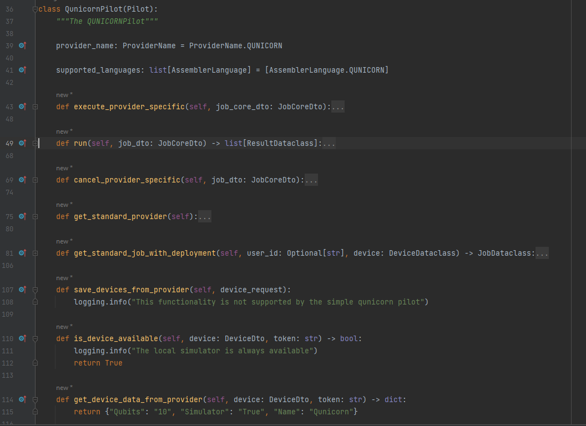
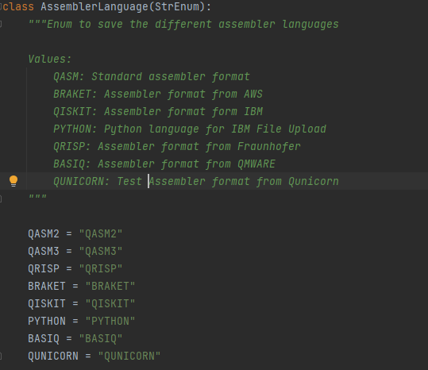

How to create a new Qunicorn-Pilot
==================================

1. Create a new python file in the `qunicorn_core.core.pilotmanager` directory. The qunicorn_pilot.py

2. For the creation you can also just copy the base_pilot.py file and rename it. Keep in mind that the supported_languages and provider_name is set in the implement your pilot chapter.

3. After at least creating the Pilot class inside extending from the base_pilot add your pilot to the "PILOTS" list in the pilotmanager.py file.

4. Add your pilot to the `qunicorn_core.core.pilotmanager` directory in the `__init__.py` file.

5. Implement your pilot

Implement your pilot
--------------------

1. Define the qunicorn provider by adding a new enum value to the ProviderName.py enum. And set it as your provider_name.
    .. image:: ../resources/images/tutorial_demo/provider.png

2. Define the supported_languages. Add a new qunicorn enum value to the AssemblerLanguage.py enum.

3. Implement all methods that raise a "NotImplementedError" in the base_pilot.py file.

    3.1: First we fill the execute methods:
        We don't need a provider-specific execution if we only have one default run method.
        The run method is just returning example results. (We do not actually have a qunicorn execution environment)
    .. image:: ../resources/images/tutorial_demo/implement_run_method.png

    3.2: Next we need to add a default Job and Deployment to the pilot to test it easily:
    .. image:: ../resources/images/tutorial_demo/implement_standard_job.png

    3.3: After adding also the other necessary methods that we do not support we are done with the pilot:
    .. image:: ../resources/images/tutorial_demo/implement_other_methods.png

4. Check out the comments in the base_pilot.py file for more information about the methods and also find some examples in the aws_pilot or ibm_pilot file.

5. Add a json file to add a default qunicorn device:
    Add the json in the pilot_resources folder:
    It is important that the name of the file is ProviderName_standard_devices, in our case qunicorn_standard_devices, so it will be used automatically.
    .. image:: ../resources/images/tutorial_demo/all_devices_json.png

Test if the current pilot already works
---------------------------------------
1. Therefor we need to restart the database: "flask recreate-and-load-db"
     (If this throws an error delete your db-instance first and check in the readme if the command changed)

2. After that the qunicorn-app can be started and the qunicorn-api can be opened: "localhost:5005/swagger-ui/"

3. Now you can first test if the default jobs are loaded in the database. In the results we see that we have a new third qunicorn-job
    .. image:: ../resources/images/tutorial_demo/test_job_api.png

3. Now you can first test if the default jobs are loaded in the database. In the results we see that we have a new third qunicorn-job
    .. image:: ../resources/images/tutorial_demo/test_job_api.png

4. To test if we can run a job on our qunicorn-pilot we can use the rerun api endpoint:
    (As it is executed asynchronously we cannot see the results directly, we only get an job-id)
    .. image:: ../resources/images/tutorial_demo/rerun_job_api.png.png

5. To checkout the results we use the next api endpoint. With the job id we got in our response (id=4).
    .. image:: ../resources/images/tutorial_demo/get_result_api.png

Change the transpile and preprocessing manager if necessary
-----------------------------------------------------------

1. If we now also want to run our qunicorn circuit on IBM we need to add a transpile method in the transpile_manager.py.
This transpile method transpiles QUNICORN into QISKIT.
    .. image:: ../resources/images/tutorial_demo/transpile_method.png

2. To test if our transpile method works we need to save our changes and then go to the qunicorn-api again:
    First we need to find out which is our default qunicorn-deployment:
    Our result is a list of deployments, we just take the one that we created:
    .. image:: ../resources/images/tutorial_demo/deployment-api.png

3. Together with the deployment Id, we can now create a new job running on IBM.
    .. image:: ../resources/images/tutorial_demo/create-ibm-job.png

4. This Job will take our qunicorn-circuit, transpile it to a qiskit circuit and then execute it on ibm:
We now get the results again and see that we have also meta_data that is specific for ibm.
    .. image:: ../resources/images/tutorial_demo/ibm_job_results.png

Add some tests and documentation
--------------------------------

1. So now the pilot is working and we need to add a small test. Therefor we need to add the two jsons in the test/test_resources folder.
    .. image:: ../resources/images/tutorial_demo/test-data.png

2. And also use them in the test_utils. Create there both static variables:
    DEPLOYMENT_QUNICORN_CIRCUITS_JSON="deployment_request_dto_with_qunicorn_circuit_test_data.json"
    JOB_JSON_QUNICORN="job_request_dto_test_data_QUNICORN.json"
    And add them to the get_test_jobs/deployments:
    .. image:: ../resources/images/tutorial_demo/use-test-data.png

3. After that a new test file can be created in automated_tests: test_qunicorn_job_execution.py
    to use the test method and test the pilot end to end:
    .. image:: ../resources/images/tutorial_demo/tests.png

4. Do not forget to write comments and documentation to your new implemented code.

